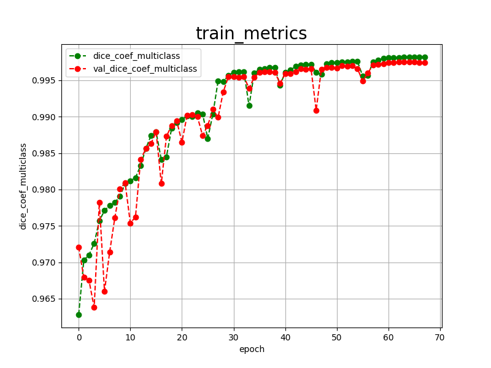

<h2>TensorFlow-FlexUNet-Image-Segmentation-TEKNOFEST-2021-Stroke-CT(2025/10/01)</h2>
Toshiyuki Arai 
Software Laboratory antillia.com  
This is the first experiment of Image Segmentation for <b>TEKNOFEST-2021-Stroke-CT</b> (hyperacute/acute ischemic areas and hemorrhagic areas), based on 
our <a href="./src/TensorFlowFlexUNet.py">TensorFlowFlexUNet</a>
 (<b>TensorFlow Flexible UNet Image Segmentation Model for Multiclass</b>)
 and a 512x512 pixels PNG ImageMask dataset which was derived by us from 
<a href="https://www.kaggle.com/datasets/orvile/inme-veri-seti-stroke-dataset/data">
<b>İNME VERİ SETİ (STROKE DATASET) 
TEKNOFEST 2021 ARTIFICIAL INTELLIGENCE DATASET IN HEALTH
</b>
</a>
 
 
<b>Actual Image Segmentation for Images of 512x512 pixels</b> 
As shown below, the inferred masks predicted by our segmentation model trained on the 
our dataset appear similar to the ground truth masks. 
<b>(hyperacute/acute ischemic areas and hemorrhagic areas)</b> 
 
<table>
<tr>
<th></th>
<!--
<th>Input: image</th>
<th>Mask (ground_truth)</th>
<th>Prediction: inferred_mask</th>
-->
</tr>
<tr>
<td></td>
</tr>
<!--
<td></td>
<td></td>
<td></td>
</tr>

<tr>
<td></td>
<td></td>
<td></td>
</tr>

<tr>
<td></td>
<td></td>
<td></td>
</tr>
-->
</table>

 

<h3>1. Dataset Citation</h3>
The dataset used here was obtained from the kaggle web site
<a href="https://www.kaggle.com/datasets/orvile/inme-veri-seti-stroke-dataset/data">
<b>İNME VERİ SETİ (STROKE DATASET) 
TEKNOFEST 2021 ARTIFICIAL INTELLIGENCE DATASET IN HEALTH
</b>
</a>
 
 
<b>About Dataset</b> 

The dataset consists of anonymized DICOM, PNG format brain CT slice images. Brain CT cross-sectional images were labeled and 
hyperacute/acute ischemic areas and hemorrhagic areas were segmented by seven (7) radiologists. 
During the labeling and segmentation process, the annotation made by one radiologist was checked by another radiologist. 
The total data set consisted of 6951 brain CT slices. Of these, 4557 had no signs of stroke or chronic ischemic stroke, 
while 2394 had acute/hyperacute ischemic stroke, hemorrhagic stroke or both types of stroke. 
The PNG format contains the original image, mask images and their overlays on the original image. 
The detailed preparation of the dataset can be found in the following article.
 
 

<b>Objective:</b> 
 The artificial intelligence competition in healthcare was organized for the first time at the annual aviation, 
 space, and technology festival (TEKNOFEST), Istanbul/Türkiye, in September 2021. 
 In this article, the data set preparation and competition processes were explained in detail; the anonymized 
 and annotated data set is also provided via official website for further research.
  

<b>Materials and Methods:</b> 
 Data set recorded over the period covering 2019 and 2020 were centrally screened from the e-Pulse and 
 Teleradiology System of the Republic of Türkiye, Ministry of Health using various codes and filtering  
 criteria. The data set was anonymized. The data set was prepared, pooled, curated, and annotated by 7 radiologists. 
 The training data set was shared with the teams via a dedicated file transfer protocol server,  
 which could be accessed using private usernames and passwords given to the teams under a nondisclosure  
 agreement signed by the representative of each team.
  
Results: The competition consisted of 2 stages. In the first stage, teams were given 192 digital 
imaging and communications in medicine images that belong to 1 of 3 possible categories namely, 
hemorrhage, ischemic, or non-stroke. 
Teams were asked to classify each image as either stroke present or absent. 
 
In the second stage of the competition, qualifying 36 teams were given 97 digital 
imaging and communications in medicine images that contained hemorrhage, ischemia, or both lesions. 
Among the employed methods, Unet and DeepLabv3 were the most frequently observed ones.
 
 
<b>Conclusion:</b> 

Koç U, Akçapınar Sezer E, Alper Özkaya Y, et al. Artificial intelligence 
in healthcare competition (TEKNOFEST-2021): 
 Stroke data set. Eurasian J Med., 2022;54(3):248-258.
 
Koç U, Akçapınar Sezer E, Özkaya YA, Yarbay Y, Taydaş O, Ayyıldız VA, Kızıloğlu HA, Kesimal U, Çankaya İ, Beşler
MS, Karakaş E, Karademir F, Sebik NB, Bahadır M, Sezer Ö, Yeşilyurt B, Varlı S, Akdoğan E, Ülgü MM, Birinci Ş. Artificial
Intelligence in Healthcare Competition (TEKNOFEST-2021): Stroke Data Set. Eurasian J Med. 2022 Oct;54(3):248-258. doi:
10.5152/eurasianjmed.2022.22096. PMID: 35943079; PMCID: PMC9797774.
 
https://acikveri.saglik.gov.tr/Home/DataSetDetail/1
 
 
<b>License</b> 

This dataset was created as part of the TEKNOFEST 2021 Artificial Intelligence in Healthcare Competition, 
in collaboration with the Turkish Health Institutes Association (TÜSEB) and the Ministry of Health.  
It contains anonymized brain CT scan images in DICOM and PNG formats and has been made publicly available as part of the competition.
 
<b>Note:</b> 
While the article published within the competition is licensed under the CC BY 4.0 license, the licensing information for the dataset itself is not explicitly stated. 
Therefore, it is recommended to contact the relevant authorities (TÜSEB/Ministry of Health) for clarification on usage rights.
 
 

<h3>
2. Brain-Stroke-CT ImageMask Dataset
</h3>
<h3>2.1 ImageMask Dataset Generation</h3>
 If you would like to train this Brain-Stroke-CT Segmentation model by yourself,
 you have to generate the PNG dataset by using the following Python scripts:
  
 <ul>
<li><a href="./generator/ImageMaskDatasetGenerator.py">ImageMaskDatasetGenerator.py</a></li>
<li><a href="./generator/split_master.py">split_master.py</a></li>
</ul>
The first script is an offline dataset augmentation tool, and the second one a dataset splitter.
On the augmentation tool, please refer to our repository <a href="https://github.com/sarah-antillia/ImageMask-Dataset-Offline-Augmentation-Tool">
ImageMask-Dataset-Offline-Augmentation-Tool
</a>.
 
 
Please put the dataset 
<a href="https://www.kaggle.com/datasets/orvile/inme-veri-seti-stroke-dataset/data">
<b>İNME VERİ SETİ (STROKE DATASET) 
TEKNOFEST 2021 ARTIFICIAL INTELLIGENCE DATASET IN HEALTH
</b>
</a> 
<!--which was downloaded from the kaggle website
--> 
under <b>./genrator</b> folder.  

We renamed the original folder names to be ordinary ascii strings as shown below. 
<pre>
./generetor
 ├─ImageMaskDatasetGeneratory.py
 ├─split_master.py
 └─STROKE-DATASET                     # Renamed from İNME VERİ SETİ 
       ...
       ├─YARISMA-VERI-SETI_2_OTURUM   # Renamed from YarısmaVeriSeti_2_Oturum
       │  ├─DICOM
       │  ├─MASKS
       │  ├─OVERLAY
       │  └─PNG
        ...
</pre>
 
 The first generator script generates a master image and mask dataset
of 512x512 pixels PNG format from <b>MASKS</b> and <b>PNG</b>
 in <b>YARISMA-VERI-SETI_2_OTURUM </b> folder..
  
 The second splitter simply splits the master into test, train and valid subsets.  

By running these Python scripts, finally a 512x512 pixels PNG Brain Stroke CT dataset will be 
created under <b>dataset</b> folder as shown below.<b></b>.  

<pre>
./dataset
└─Stroke
    ├─test
    │   ├─images
    │   └─masks
    ├─train
    │   ├─images
    │   └─masks
    └─valid
        ├─images
        └─masks
</pre>
<b>Stroke Statistics</b> 
 
 
As shown above, the number of images of train and valid datasets is not so large to use for a training set of our segmentation model.
  
<b>You may not redistribute this training dataset generated from 
<a href="https://www.kaggle.com/datasets/orvile/inme-veri-seti-stroke-dataset/data">
<b>İNME VERİ SETİ (STROKE DATASET) 
TEKNOFEST 2021 ARTIFICIAL INTELLIGENCE DATASET IN HEALTH
</b>, and commercial use of this dataset is prohibited.</b> 
</a> 
 

<h3>2.2 Mini-test Dataset Generation</h3>
You also have to generate a <b>mini_test</b> dataset from <b>Stroke/test</b> subset by yourself, 
depending on your choices,
which can be used in EpochChangeInferencer Callback and an actual segmentation (predictioin) process.
 
<pre>
./projects
└─TensorflowFlexUNet
       └─Stroke
             └─mini_test
                ├─images
                └─masks
</pre>

<b>Stroke Statistics</b> 
 
 
As shown above, the number of images of train and valid datasets is not large  to use for a training set of our segmentation model.
 
 
 
<b>2.3 Train_images_sample</b> 

 
<b>Train_masks_sample</b> 

 

<h3>
3 Train TensorFlowUNet Model
</h3>
 We trained Stroke TensorFlowFlexUNet Model by using the following
<a href="./projects/TensorFlowFlexUNet/Stroke/train_eval_infer.config"> <b>train_eval_infer.config</b></a> file.  
Please move to ./projects/TensorFlowFlexUNet/Strokeand run the following bat file. 
<pre>
>1.train.bat
</pre>
, which simply runs the following command. 
<pre>
>python ../../../src/TensorFlowFlexUNetTrainer.py ./train_eval_infer.config
</pre>

<b>Model parameters</b> 
Defined a small base_filters=16 and large base_kernels=(9,9) for the first Conv Layer of Encoder Block of 
<a href="./src/TensorFlowFlexUNet.py">TensorFlowFlexUNet.py</a> 
and a large num_layers (including a bridge between Encoder and Decoder Blocks).
<pre>
[model]
image_width    = 512
image_height   = 512
image_channels = 3

num_classes    = 3

base_filters   = 16
base_kernels   = (9,9)
num_layers     = 8
dropout_rate   = 0.04
dilation       = (1,1)
</pre>

<b>Learning rate</b> 
Defined a small learning rate.  
<pre>
[model]
learning_rate  = 0.00005
</pre>

<b>Online augmentation</b> 
Disabled our online augmentation.  
<pre>
[model]
model         = "TensorFlowFlexUNet"
generator     = False
</pre>

<b>Loss and metrics functions</b> 
Specified "categorical_crossentropy" and <a href="./src/dice_coef_multiclass.py">"dice_coef_multiclass"</a>. 
<pre>
[model]
loss           = "categorical_crossentropy"
metrics        = ["dice_coef_multiclass"]
</pre>
<b>Learning rate reducer callback</b> 
Enabled learning_rate_reducer callback, and a small reducer_patience.
<pre> 
[train]
learning_rate_reducer = True
reducer_factor     = 0.4
reducer_patience   = 4
</pre>

<b>Early stopping callback</b> 
Enabled early stopping callback with patience parameter.
<pre>
[train]
patience      = 10
</pre>

<b>RGB Color map</b> 
rgb color map dict for Stroke 1+1 classes.
<pre>
[mask]
mask_datatype    = "categorized"
mask_file_format = ".png"
;Stroke rgb color map dict for 1+2 classes.
; hyperacute/acute ischemic areas and hemorrhagic areas
rgb_map = {(0,0,0):0,(0,255,0):1, (0,0,255):2}
</pre>

<b>Epoch change inference callback</b> 
Enabled <a href="./src/EpochChangeInferencer.py">epoch_change_infer callback (EpochChangeInferencer.py)</a></b>. 
<pre>
[train]
epoch_change_infer       = True
epoch_change_infer_dir   =  "./epoch_change_infer"
num_infer_images         = 6
</pre>

By using this callback, on every epoch_change, the inference procedure can be called
 for 6 images in <b>mini_test</b> folder. This will help you confirm how the predicted mask changes 
 at each epoch during your training process.    

<b>Epoch_change_inference output at starting (epoch 1,2,3)</b> 
 
 
<b>Epoch_change_inference output at middlepoint (epoch 32,33 34)</b> 
 
 

<b>Epoch_change_inference output at ending (epoch 66,67,68)</b> 
 
 

In this experiment, the training process was stopped at epoch 68 by EarlyStopping Callback.  
 
 

<a href="./projects/TensorFlowFlexUNet/Stroke/eval/train_metrics.csv">train_metrics.csv</a> 
 

 
<a href="./projects/TensorFlowFlexUNet/Stroke/eval/train_losses.csv">train_losses.csv</a> 
 

 

<h3>
4 Evaluation
</h3>
Please move to a <b>./projects/TensorFlowFlexUNet/Stroke</b> folder, 
and run the following bat file to evaluate TensorFlowUNet model for Stroke. 
<pre>
./2.evaluate.bat
</pre>
This bat file simply runs the following command.
<pre>
python ../../../src/TensorFlowFlexUNetEvaluator.py ./train_eval_infer.config
</pre>

Evaluation console output: 

  Image-Segmentation-Stroke

<a href="./projects/TensorFlowFlexUNet/Stroke/evaluation.csv">evaluation.csv</a> 

The loss (categorical_crossentropy) to this Stroke/test was very low, and dice_coef_multiclass very high as shown below.
 
<pre>
categorical_crossentropy,0.0049
dice_coef_multiclass,0.9974
</pre>
 
<h3>
5 Inference
</h3>
Please move to a <b>./projects/TensorFlowFlexUNet/Stroke</b> folder 
,and run the following bat file to infer segmentation regions for images by the Trained-TensorFlowUNet model for Stroke. 
<pre>
./3.infer.bat
</pre>
This simply runs the following command.
<pre>
python ../../../src/TensorFlowFlexUNetInferencer.py ./train_eval_infer.config
</pre>

<b>mini_test_images</b> 
 
<b>mini_test_mask(ground_truth)</b> 
 

<b>Inferred test masks</b> 
 
 

<b>Enlarged images and masks </b> 

<table>
<tr>
<th></th>
<!--
<th>Image</th>
<th>Mask (ground_truth)</th>
<th>Inferred-mask</th>
-->
</tr>
<tr>
<td></td>
</tr>

<tr>
<td></td>
</tr>

<!--
<tr>
<td></td>
<td></td>
<td></td>
</tr>

<tr>
<td></td>
<td></td>
<td></td>
</tr>

<tr>
<td></td>
<td></td>
<td></td>
</tr>
<tr>
<td></td>
<td></td>
<td></td>
</tr>
<tr>
<td></td>
<td></td>
<td></td>
</tr>
<tr>
<td></td>
<td></td>
<td></td>
</tr>
-->
</table>

 

<h3>
References
</h3>

<b>1. Artificial Intelligence in Healthcare Competition (TEKNOFEST-2021):Stroke Data Set</b> 
Ural Koç,, Ebru Akçapınar Sezer, Yaşar Alper Özkaya, Yasin Yarbay4 , Onur Taydaş, 
Veysel Atilla Ayyıldız , Hüseyin Alper Kızıloğlu, Uğur Kesimal, İmran Çankaya, Muhammed Said Beşler, 
Emrah Karakaş, Fatih Karademir, Nihat Barış Sebik, Murat Bahadır , Özgür Sezer, 
Batuhan Yeşilyurt, Songul Varlı, Erhan Akdoğan, Mustafa Mahir Ülgü , Şuayip Birinci 

<a href="https://www.eajm.org/en/artificial-intelligence-in-healthcare-competition-teknofest-2021-stroke-data-set-1618971">
https://www.eajm.org/en/artificial-intelligence-in-healthcare-competition-teknofest-2021-stroke-data-set-1618971
</a>

  
<b>2. Hemorrhagic stroke lesion segmentation using a 3D U-Net with squeeze-and-excitation blocks</b> 
Valeriia Abramova, Albert Clèrigues, Ana Quiles, Deysi Garcia Figueredo, Yolanda Silva, Salvador Pedraza, 
 Arnau Oliver, Xavier Lladó 
<a href="https://www.sciencedirect.com/science/article/pii/S0895611121000574">
https://www.sciencedirect.com/science/article/pii/S0895611121000574
</a>
 
 
<b>3. Segmentation of acute stroke infarct core using image-level labels on CT-angiography</b> 
Luca Giancardo, Arash Niktabe, Laura Ocasio, Rania Abdelkhaleq, Sergio Salazar-Marioni, Sunil A Sheth 
<a href="https://pmc.ncbi.nlm.nih.gov/articles/PMC10011814/">
https://pmc.ncbi.nlm.nih.gov/articles/PMC10011814/
</a>
 
 
<b>4. TensorFlow-FlexUNet-Image-Segmentation-Brain-Stroke-CT</b> 
Toshiyuki Arai antillia.com 
<a href="https://github.com/sarah-antillia/TensorFlow-FlexUNet-Image-Segmentation-Brain-Stroke-CT">
https://github.com/sarah-antillia/TensorFlow-FlexUNet-Image-Segmentation-Brain-Stroke-CT
</a>

